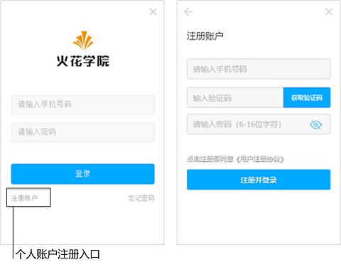
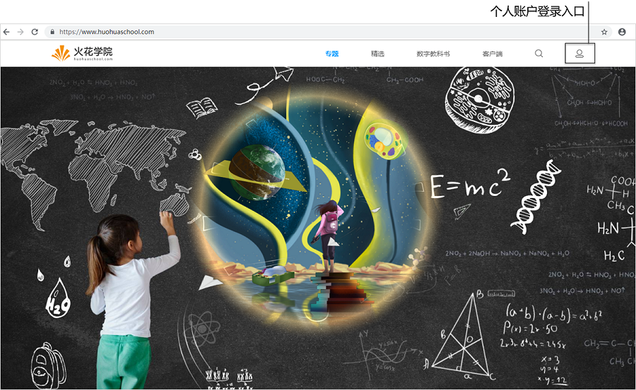
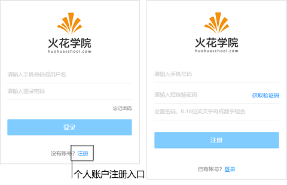
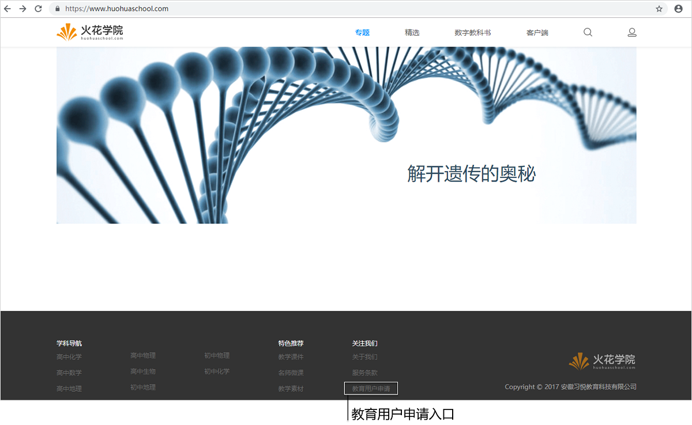
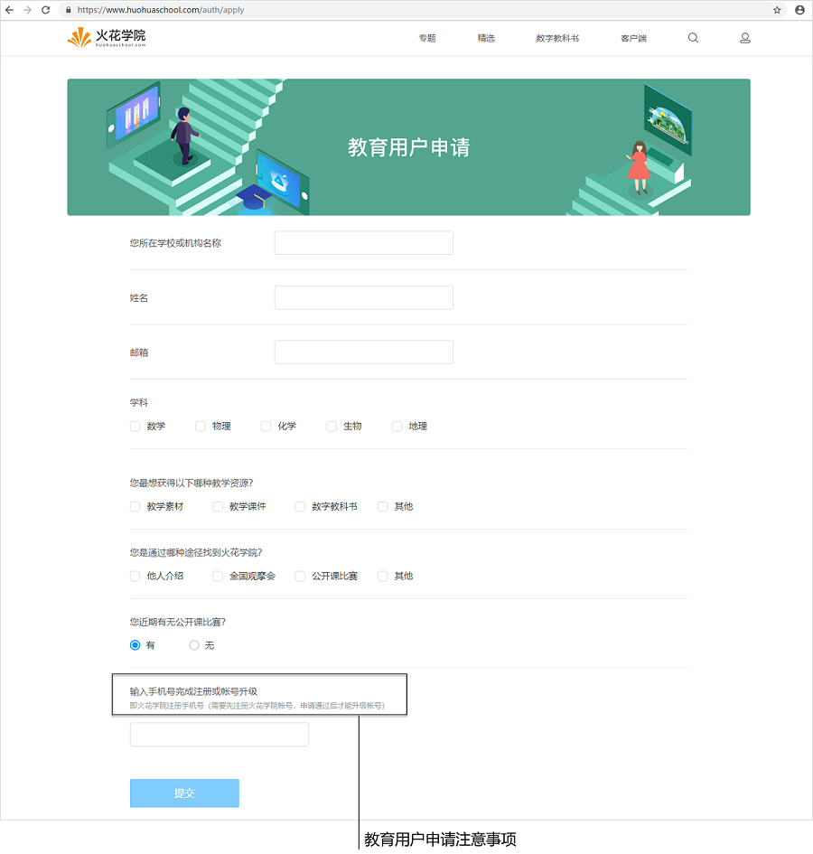

## 创建账户

### 个人账户申请

**客户端**

&#160; &#160; &#160; &#160;软件安装成功后，打开软件，点击下方“注册账户”进入创建界面，输入“手机号码”、获取并输入“验证码”、并设置“密码”后，单击“注册并登陆”即可。

**官网**

&#160; &#160; &#160; &#160;进入[官网](www.huohuaschool.com)，点击右上角用户头像进入登录页面，单击下方“注册”，注册方法与客户端申请相同。

### 教育用户申请

**官网**

&#160; &#160; &#160; &#160;教育用户可以在[官网](www.huohuaschool.com)底部导航栏中找到-教师用户申请，输入手机号及相关信息，以完成火花学院账号的注册申请，申请成功后，初始密码为123456。如有需要，可以申请修改密码。

&#160; &#160; &#160; &#160;需要注意的是需先注册火花学院个人用户帐号，申请通过后才能升级帐号。

