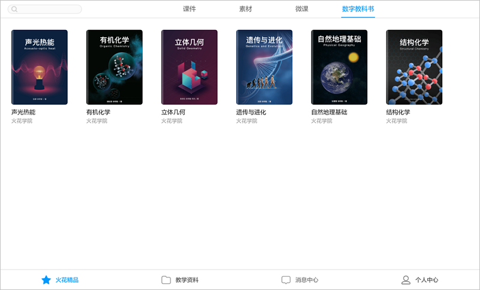

## 纸质版操作

### 使用范围
&#160; &#160; &#160; &#160;纸质教科书中带有以下三类图标的图片可扫描播放。

  

### 下载电子版

&#160; &#160; &#160; &#160;登录客户端，进入火花精品，点击右上方“数字教科书”，选取书本进入详情页。

&#160; &#160; &#160; &#160;单击右下方“下载”按钮，即可在“教学资料”-“书架”中查看。

 

### 素材播放
&#160; &#160; &#160; &#160;电子版下载成功后打开，在数字教科书页面单击“扫描实体书”，镜头打开后对准需要播放的带图标的图片，轻触进入稳定播放状态。

 

&#160; &#160; &#160; &#160;点击屏幕中出现的素材，则素材就保留在屏幕中。

 