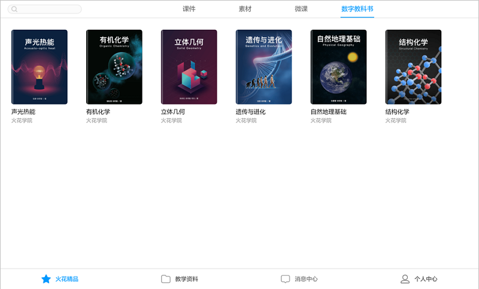
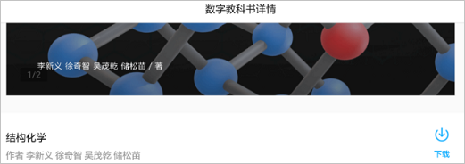
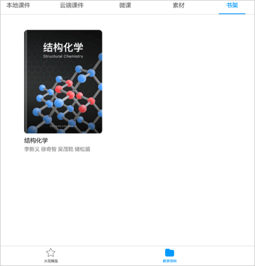
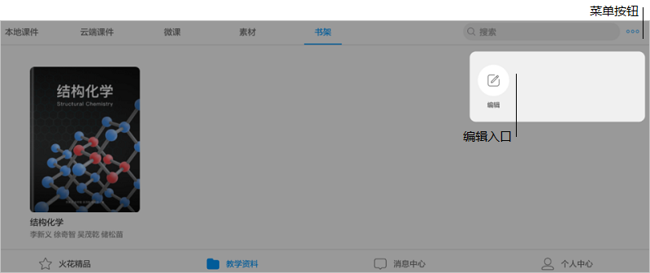
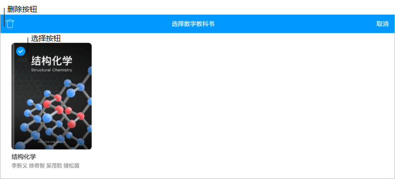
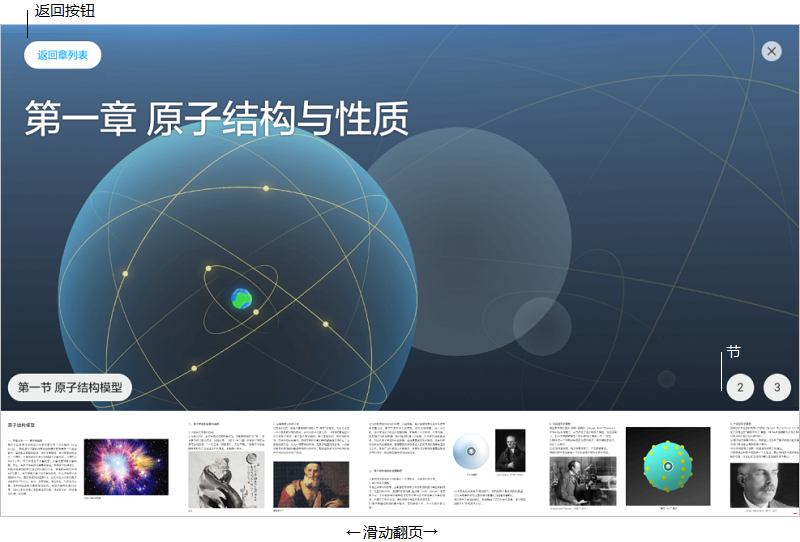
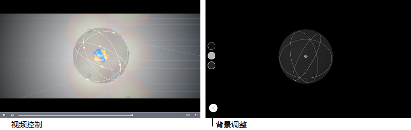

## 数字教科书的使用

### 如何获取教材

&#160; &#160; &#160; &#160;为适应不同教学场景，火花学院新媒体专题教材分为数字教科书及纸质教科书两种形式，数字教科书于火花学院系统内下载。  

### 下载与删除

&#160; &#160; &#160; &#160;登录客户端，进入火花精品，点击右上方“数字教科书”，选取书本进入详情页。

&#160; &#160; &#160; &#160;单击右下方“下载”按钮，即可在“教学资料”-“书架”中查看。

 

&#160; &#160; &#160; &#160;单击右上角菜单按钮，选择“编辑”选项，勾选需要删除的教科书，轻触右上角垃圾箱按钮完成操作。

### 数字教科书的使用

#### 打开与关闭

&#160; &#160; &#160; &#160;在书架中下载完成的教科书，离线可查看，单击封面打开。

#### 翻阅与阅读

&#160; &#160; &#160; &#160;滑动选择“章”，“节”，也可在每一章内点选右下角节数，点击左上角“返回章列表”可重新选择。

#### 素材播放

&#160; &#160; &#160; &#160;数字教科书包含三种新媒体素材，如下所示分别为视频、AR素材及互动微件。点击中央按钮打开播放。  

  

&#160; &#160; &#160; &#160;视频可拉动调整播放进度，AR素材及互动微件播放时，可根据场景调整背景颜色，以适应不同教学需求，播放完毕点击左下角按钮即可关闭。

