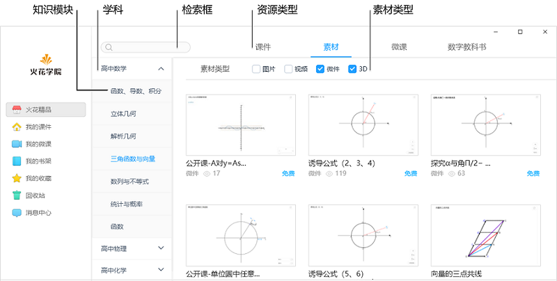

## 查找与预览

### 客户端

**查找**

&ensp;&ensp;&ensp;&ensp;PC及移动客户端内容组织逻辑相同，在“火花精品”中均提供知识模块点选和关键词检索两种资源查找方式，依次框定学科、知识模块、资源类型及素材类型后翻查符合需求的文件或直接在检索框输入关键词检索即可。

**预览**

&#160; &#160; &#160; &#160;老师选定后，点击进入单个资源页面，可预览浏览量及内容概述。

### 官网

**查找**

&ensp;&ensp;&ensp;&ensp;PC端官网[精选](https://www.huohuaschool.com/store)版块“快速查找”中列举了热门查找主题，老师可直接单击进入主题查看各种类型的可视化内容，如没有老师需要的主题，可随意选择某个主题进入后，再根据需求二次查找，即可按学科、知识模块、资源类型翻查也可单击右上角检索入口，按关键词检索。

**预览**

&#160; &#160; &#160; &#160;老师选定后，点击进入单个资源页面，可预览浏览量及内容概述，相较客户端官网增加了拓展素材导航区。

