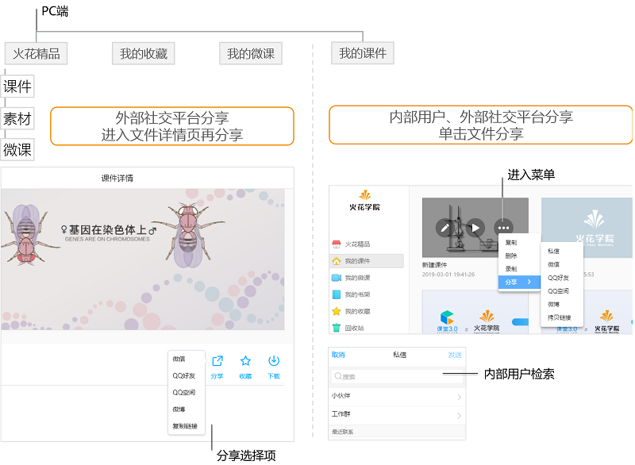

## 社交平台分享

### 可分享范围

&ensp;&ensp;&ensp;&ensp;1、PC端“火花精品”和“我的书架”中的数字教科书不可分享，其余内容均可分享。

&ensp;&ensp;&ensp;&ensp;2、移动端“火花精品”中的数字教科书不可分享，“教学资料”中的本地、素材、书架中的内容不可分享，其余内容均可分享。

### 分享路径

&ensp;&ensp;&ensp;&ensp;1、PC端支持内部用户间分享和外部主流社交平台分享。分享路径如下：

&ensp;&ensp;&ensp;&ensp;2、移动端支持内部用户间分享和外部主流社交平台分享。分享路径如下：

