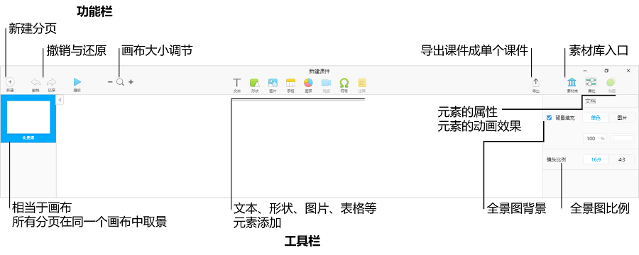

## 课件制作指南

### 新建课件

&ensp;&ensp;&ensp;&ensp;打开桌面端火花学院软件，在”我的课件“下，选择”新建课件“，进入主题选择界面，火花学院提供两种课件模板，一种是默认主题，默认白色和黑色背景；另一种是课件的通用模版，教师可根据自己的需要选择主题。点击底部使用，即可新建课件。

### 编辑界面

### 新建镜头

&ensp;&ensp;&ensp;&ensp;点击“新建”，则可以新建镜头，镜头对应的是课件的每一页。选定全景图中某一页，可进行拖动，单页之间的位置反应内容之间的逻辑关系。

### 添加元素

&ensp;&ensp;&ensp;&ensp;1.点击左侧镜头（分页）进入镜头。

&ensp;&ensp;&ensp;&ensp;2.点击工具栏，可添加不同类型的元素。

&ensp;&ensp;&ensp;&ensp;3.选定单个元素，右侧可进行相应属性编辑。

### 添加素材

&ensp;&ensp;&ensp;&ensp;1.老师想在镜头（分页）内右上角素材库中，检索到所需素材，可拖拽到镜头内，素材支持预览。

&ensp;&ensp;&ensp;&ensp;2.支持素材在镜头内的属性编辑。

### 课件播放

