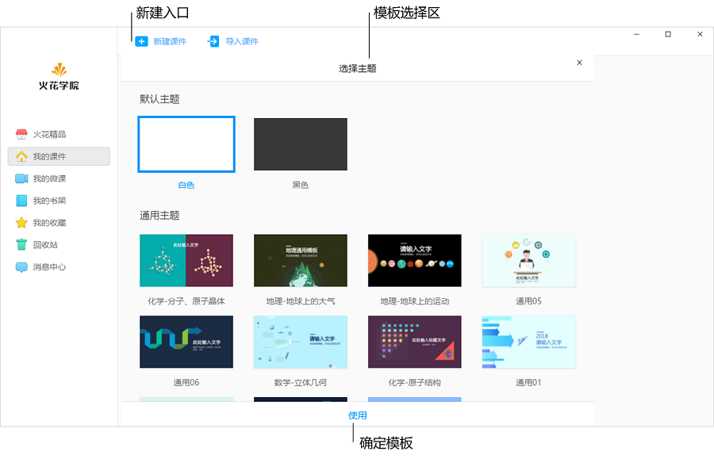

## 课件制作指南

### 新建课件

&ensp;&ensp;&ensp;&ensp;打开桌面端火花学院软件，在”我的课件“下，选择”新建课件“。

&ensp;&ensp;&ensp;&ensp;火花学院提供两种课件模板，一种是默认主题，默认白色和黑色背景；另一种是课件的通用模版，教师可根据自己的需要选择主题。点击底部使用，即可新建课件。

### 界面简介
### 新建镜头
### 添加元素
### 课件播放

