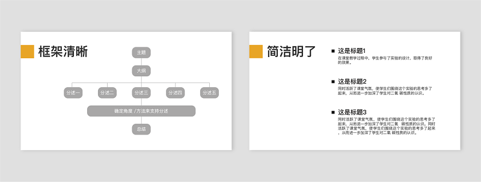
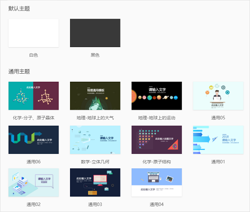
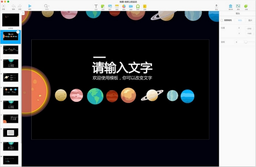
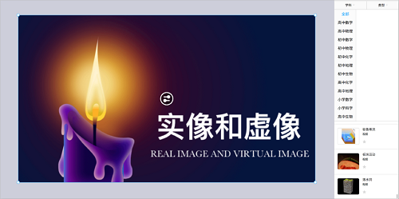
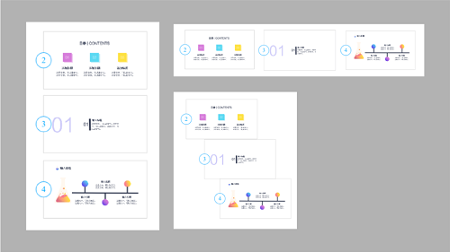
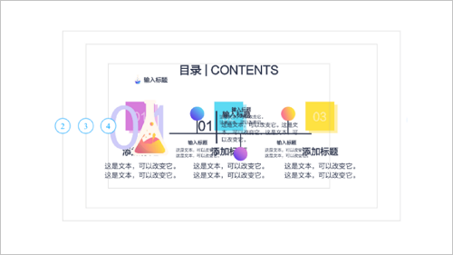
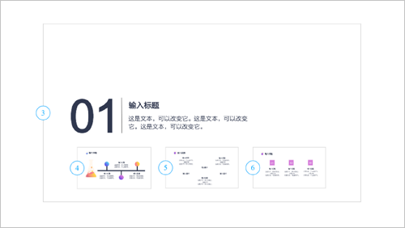
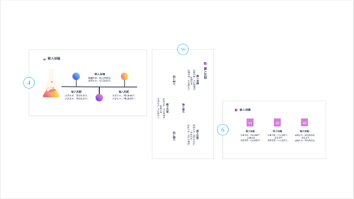
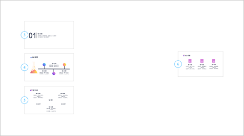

## 让你的课件趣味十足

&ensp;&ensp;&ensp;&ensp;能够将复杂的信息展示明白，就是好课件，同时课件作为一种“可视化”的传递信息的介质，应满足视觉上的美观。

### 一、框架明确，层级清晰，文字精简

&ensp;&ensp;&ensp;&ensp;清晰的脉络或结构必不可少，课件上的文字需从教案出发，明确重点信息，删繁就简，避免文字类元素比重太大带来的视觉疲劳。

### 二、好的主题风格决定课件的颜值

&ensp;&ensp;&ensp;&ensp;清晰、精炼的内容提高信息传递效率，贴合内容主题的排版风格提升知识传递效果。

&ensp;&ensp;&ensp;&ensp;火花学院编辑器提供两类主题模版：默认主题和通用主题。通用主题模版包含全景图图片素材以及多种排版样式的页面，可适用于多种演示场景。其中各类学科主题模板老师可直接应用到相应课程课件中，也可根据课件内容进行修改和再创作。

&ensp;&ensp;&ensp;&ensp;以地理模板《地球的运动》为例，模版上提供多个与主题《地球的运动》相关的图像元素，均可缩放、移动，改变它们的排列方式，即可做出一幅专属于你的全景图。

### 三、10000+可视化素材让课件活起来

&ensp;&ensp;&ensp;&ensp;火花学院可视化素材库针对性强，适当加入科学可视化素材使课件由平面变立体，由静态变动态，由单向传播变双向互动，能产生足够的视觉吸引力，甚至带来多种感官反应。

### 四、思维场景组织信息逻辑

&ensp;&ensp;&ensp;&ensp;与传统ppt线性逻辑不同，火花课件的思维场景式课件，融入全景图概念，是整体到局部的演示方式，平移、缩放、旋转通过镜头无缝衔接，使画面充满动感的同时，也在逐步表达内部逻辑，牢牢抓住观众眼球。以下5种页面摆放方式，可根据教学内容的逻辑关系选用。

&ensp;&ensp;&ensp;&ensp;1、平级关系

&ensp;&ensp;&ensp;&ensp;如下图，可将镜头横排、竖排和斜排，当几个页面大小接近、间距较小时，就可表达平级关系。 
 

&ensp;&ensp;&ensp;&ensp;2、递进关系

&ensp;&ensp;&ensp;&ensp;页面逐步变小会产生步步深入的效果，表达不断递进的关系；反之页面逐步放大，会产生慢慢走出来的效果，表达总结归纳的关系。

 
&ensp;&ensp;&ensp;&ensp;3、从属关系

&ensp;&ensp;&ensp;&ensp;页面缩小并包含在大的页面内，可表达从属关系。 

 
&ensp;&ensp;&ensp;&ensp;4、转折关系

&ensp;&ensp;&ensp;&ensp;话锋突转，可将页面做90度旋转，接下来的页面再转回来，带来一种把话题拉回的效果。不建议随意旋转角度，易产生眼花缭乱的视觉效果。 

 
&ensp;&ensp;&ensp;&ensp;5、题外话

&ensp;&ensp;&ensp;&ensp;页面之间距离越远，它们之间的关系就越远，所以当我们想插题外话时，可使用这种远距离来表达。 

### 五、细节处理，整体色调、风格保持视觉统一性

&ensp;&ensp;&ensp;&ensp;颜色影响人的情绪体验，良好的艺术效果使人心情愉悦，更易接受新知识、新观点，因此一个精美的课件，其色调、风格应统一。所选文字的颜色与背景相适宜，搭配起来便于观看，相同级别的文字大小、字体一致，逻辑关系更直观，这些都能提升课堂效果。

&ensp;&ensp;&ensp;&ensp;文字和内容的处理方式：

&ensp;&ensp;&ensp;&ensp;1、文字排版

&ensp;&ensp;&ensp;&ensp;文字内容主次分明，通过调整文字大小、粗细、分行等突出重点。字体不宜超过3种。  
 
&ensp;&ensp;&ensp;&ensp;2、图片排版

&ensp;&ensp;&ensp;&ensp;单张图片使用应铺满镜头，选择分辨率高的图片，低质量图片呈现的画面会模糊不清，影响观感，而多张图片排列，应错落有序，主次分明，大小搭配，重点图片可放大展示。 
 
&ensp;&ensp;&ensp;&ensp;3、图文结合

&ensp;&ensp;&ensp;&ensp;底图+文字的形式适用于文字少的页面。图文关联，烘托氛围。当底图太花时，可以在底图加上色块或半透明色块再输入文字。 

&ensp;&ensp;&ensp;&ensp;大图+文字的形式也适用于文字少的页面。大图与文字相关联，用于解释文字。
  
&ensp;&ensp;&ensp;&ensp;文字+小图的形式以文字为主，图片为辅，文字与配图多为对应关系。 
 
&ensp;&ensp;&ensp;&ensp;4、颜色搭配统一

&ensp;&ensp;&ensp;&ensp;选择颜色的基本原则是保持整体色调一致，视觉舒适，通过局部色彩对比，提升辨识度。
目前的教学环境大多是学生较多的大班课堂，通常照明较好，多使用中低档投影仪。为了保证学生能够看清黑板，并观察到教师的肢体语言，教学课件宜采用冷色系浅色背景搭配浅色文字，如蓝色背景、白色文字和线条。每页使用的颜色应尽量一致，且不宜超过三种。 
 
&ensp;&ensp;&ensp;&ensp;5、动画使用

&ensp;&ensp;&ensp;&ensp;使用动画的目的是强化视觉指向，展现内容逻辑。利用动画可以将同一页面内的多个图文要素按照既定的顺序和特殊的方式进行显示。

&ensp;&ensp;&ensp;&ensp;适当添加动画能给课件加分。火花学院提供 “淡入”、“淡出”等动画以增加课件的趣味性。需要注意的是，每页动画尽量保持统一，不宜太花哨，动画的使用重点是传达信息，而不是天花乱坠。

