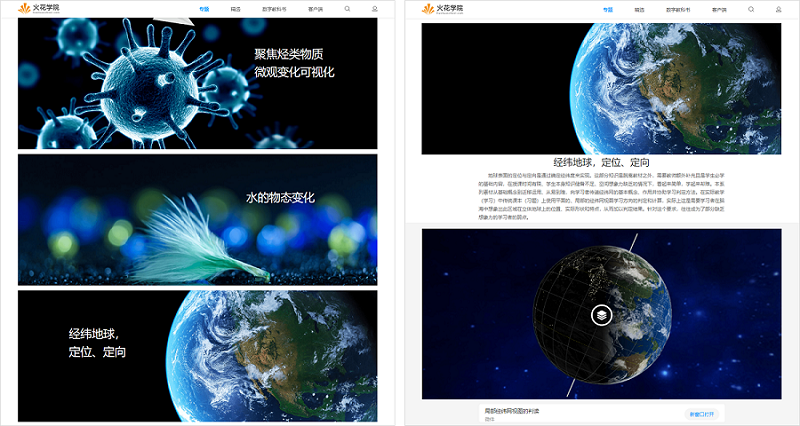

## 火花学院有哪些资源

&ensp;&ensp;&ensp;&ensp;火花学院科学可视化资源针对不同的教学应用需求，提供相应的内容组织方式，覆盖小学、初中、高中全学段数学、物理、化学、生物、地理5大学科46个知识模块，包含新型3D、Widget及传统图片、视频、音频等形式，在学科教学设计基础上，按照知识粒度从小到大组织为素材库、课件库、微课库与系列数字教学参考书，方便老师根据自身需求进行组合、修改与再创作。

&ensp;&ensp;&ensp;&ensp;火花学院PC端及移动端官网以专题形式呈现可视化教学内容系列。

